# 2020년 지역밀착형 연구활동 지원사업
# Contents
1. 지원공고
2. 팀 빌딩
3. 리빙랩 교육
4. 아이디어 제안
5. 컨소시엄 구성
6. 스토리보드 제작, DB 설계
7. 개발
　  
## 1. 지원공고
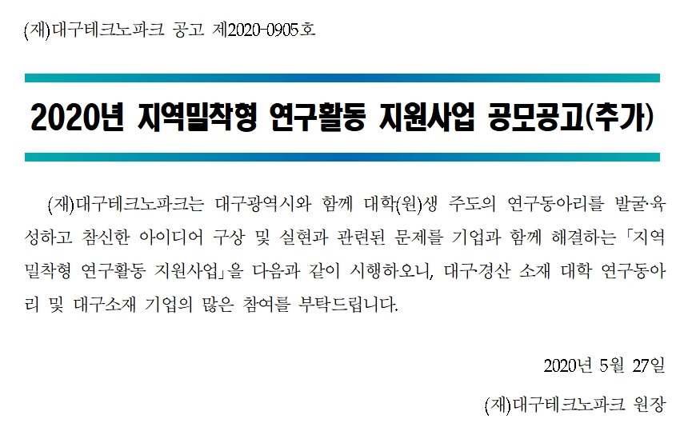  
　    
## 2. 팀 빌딩
전자공학부, 컴퓨터학부, 경영학부, 그리고 신문방송학과에서 모인 다양한 전공의 학부생들이 모여서 연구활동 지원사업에 지원함
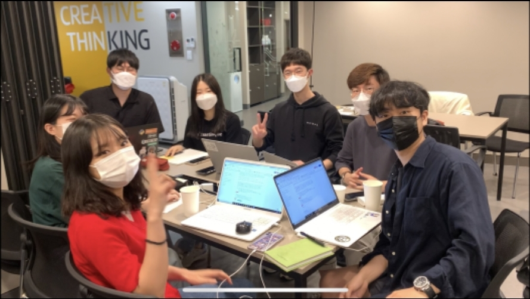  
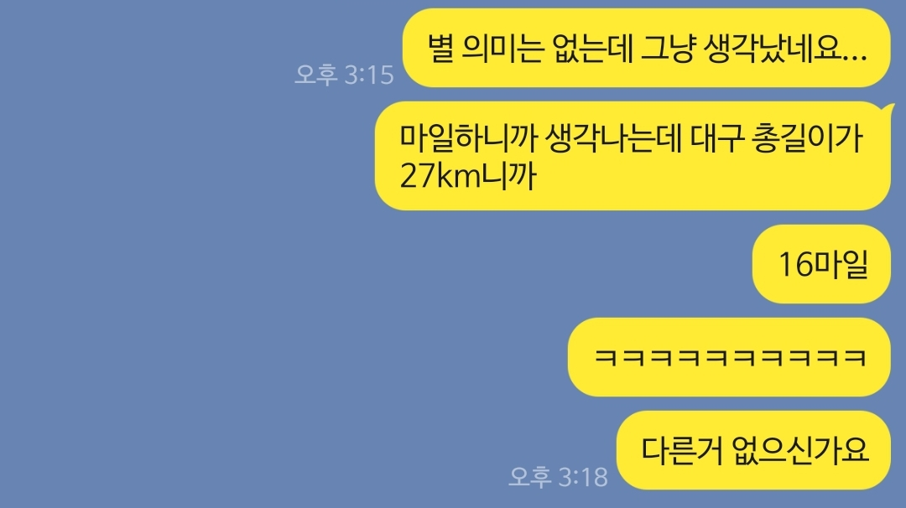   
팀 이름은 16마일으로 결정 ~~(사실 대구 총 길이가 16마일이 아니라 낙동강 길이가 16마일이다)~~
　    
## 3. 리빙랩 교육
지역의 문제를 우리가 직접 해결하자!(리빙랩)를 주제로 교육 진행
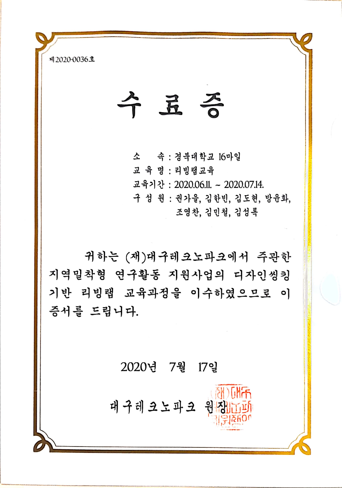
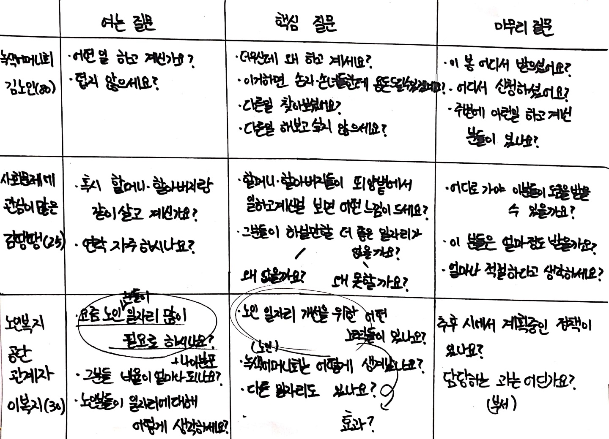
　  
## 4. 아이디어 제안
### Good Data : 데이터 라벨링으로 쉽게 하는 기부
- 인공지능 연구에 필요한 데이터 라벨링 작업을 통해 간편하고 재미있는 기부문화 선도
- 인공지능 연구에 있어서, 데이터에 의미를 부여해주는 데이터 라벨링 작업이 대규모로 요구됨
- 키오스크를 통해 간단한 작업만 진행한다면 자신의 돈을 사용하지 않고도 기부를 할 수 있는 기대효과  

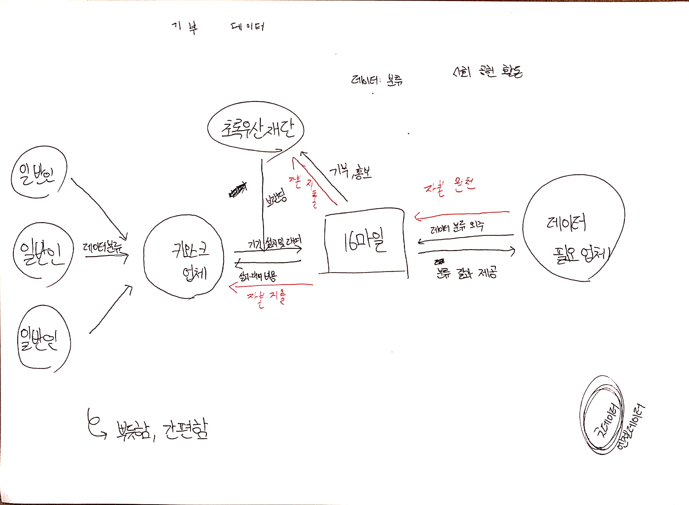  
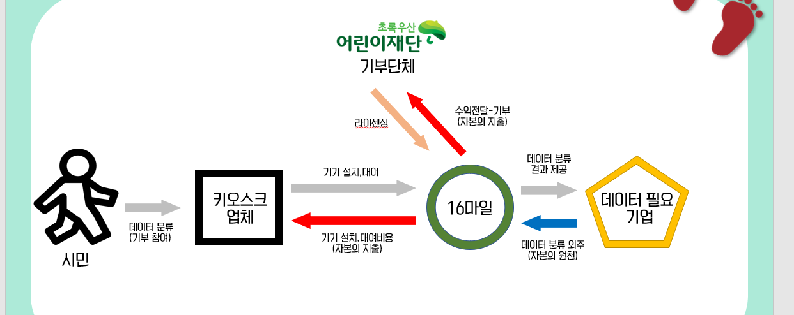  
　    
## 5. 컨소시엄 구성
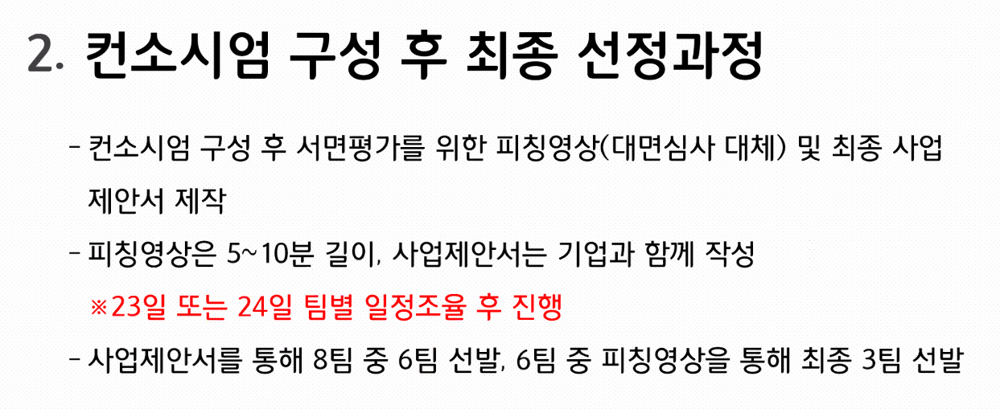  
코로나 바이러스로 인해 언택트(비대면)으로 피칭 진행.  
최종 6팀중에 3팀으로 선정되었다.

　    
## 6. 스토리보드 제작, DB 설계
### 개발자 회의
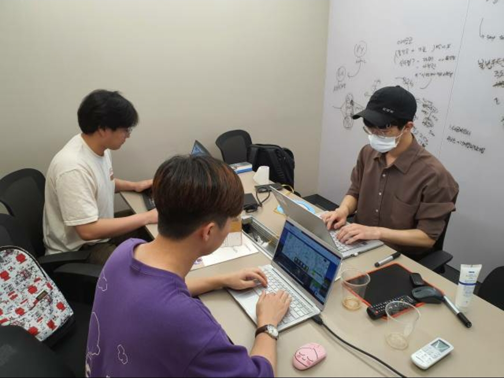  
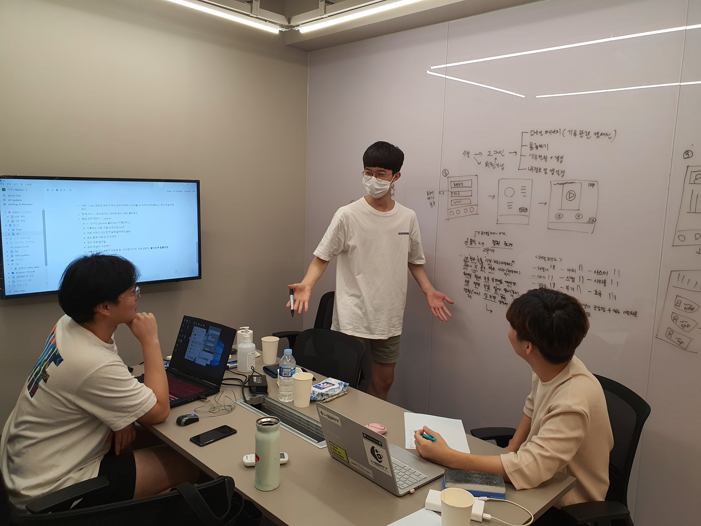  
### DB 설계, 연결 
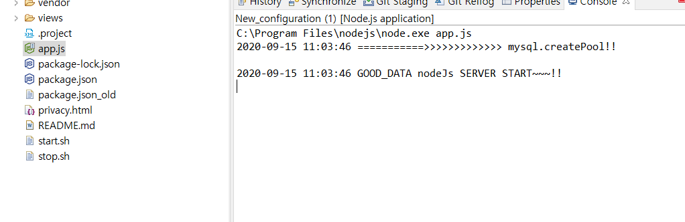  
(DB 설계도는 보안상 삭제하였습니다.)
　    
## 7. 개발
- **Language** : Python 3.8
- **Framework** : Django 2.0
- **DataBase** : MySQL
- **VCS** : Github
- **IDE** : Pycharm

  
  

...진행중