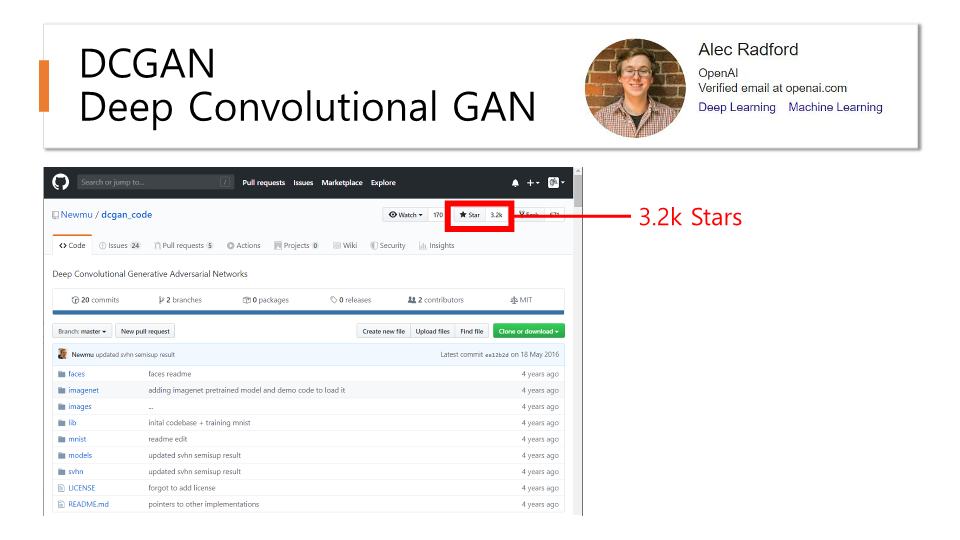
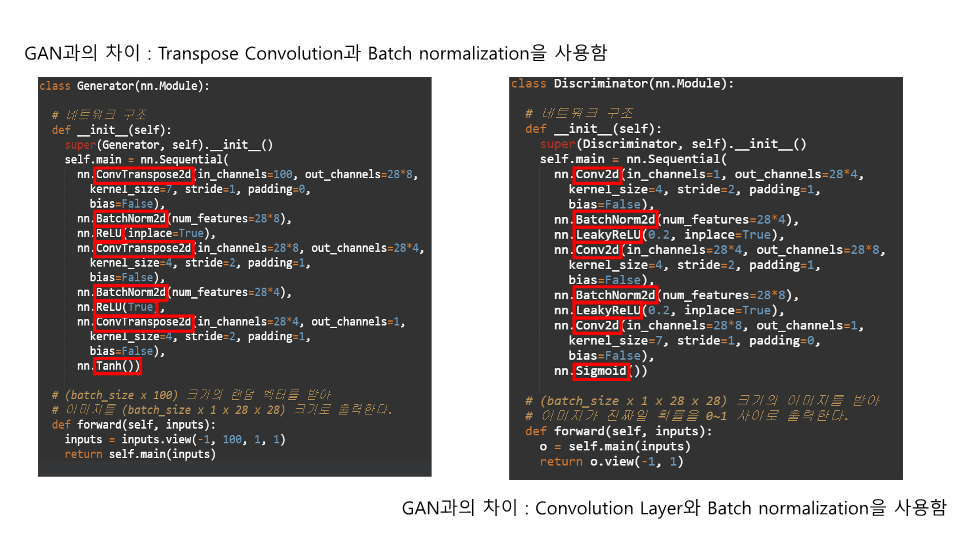

# GANstudy
GAN을 이용해서 적대적 생성 신경망을 학습해보자  
- **Dataset** : CIFA10, MNIST
- **Architecture** : GAN, ACGAN, DCGAN, STARGAN..
- **Environment** : Linux
- **Language** : Python
- **IDE** : Pycharm, Jupyter notebook
## GAN Result
### Epoch0
  
### Epoch14  
  
### Epoch59  
  
## DCGAN Seminar - presentation

  
  
  
  
  
  
   
   
  