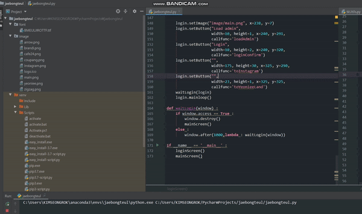

# 재봉틀
## 쇼핑몰 프로세스
상품 등록, 상품 수정, 주문 수집, 송장 전송, 고객 관리  
## 문제점
1. 한 명의 사업자가 위의 업무를 모두 부담함
2. 쇼핑몰 1~2개 까지는 괜찮지만, 5개 이상 넘어가기에는 부담이 큼
3. 파이썬 + 웹 크롤링으로 위의 업무를 자동화 시켜보자  

## 기술 스택
1. Python
2. Tkinter
3. Multiprocessing
4. Web crawling
5. openpyxl

## Code
```python
# main part
import tkinter as tk
import tkinter.ttk as ttk
import tkUtils
from tkintertable import TableCanvas, TableModels
from tksheet import Sheet

'''
self.geometry("800x680+100+100")
self.resizable(False, False)
self.title("재봉틀")
self.iconbitmap('./logo.ico')

self.loginScreen()
self.draw()

def draw(self):
self.setImage("main.png",0,0)
self.setFrame(width=800, height=2, x=0, y=150)
self.setText("학번", x=20, y=165.5)
self.setText("아이디", x=180, y=165.5)
self.setText("비밀번호", x=350, y=165.5)
'''

def mainScreen() :
    main = tkUtils.window()
    main.geometry("1280x720+100+100")
    main.resizable(False, False)
    main.title("재봉틀")
    main.iconbitmap('image/logo.ico')

    menubar = tk.Menu(main)
    menu_1 = tk.Menu(menubar, tearoff=0)
    menu_1.add_command(label="하위 메뉴 1-1")
    menu_1.add_command(label="하위 메뉴 1-2")
    menu_1.add_separator()
    menu_1.add_command(label="하위 메뉴 1-3")
    menubar.add_cascade(label="상위 메뉴 1", menu=menu_1)

    menu_2 = tk.Menu(menubar, tearoff=0, selectcolor="red")
    menu_2.add_radiobutton(label="하위 메뉴 2-1", state="disable")
    menu_2.add_radiobutton(label="하위 메뉴 2-2")
    menu_2.add_radiobutton(label="하위 메뉴 2-3")
    menubar.add_cascade(label="상위 메뉴 2", menu=menu_2)

    menu_3 = tk.Menu(menubar, tearoff=0)
    menu_3.add_checkbutton(label="하위 메뉴 3-1")
    menu_3.add_checkbutton(label="하위 메뉴 3-2")
    menubar.add_cascade(label="상위 메뉴 3", menu=menu_3)

    main.config(menu=menubar)

    notebook = ttk.Notebook(main,width=1270,height=665)
    notebook.place(x=0,y=0)

    ### 주문 처리 ########################################################

    frame1 = tkUtils.sideNotebook(main)
    notebook.add(frame1, text="주문 처리")

    frame1.setFrame(x=20, y=70, width=210, height=520)
    frame1.setImage('image/arrow.png', x=105, y=168)
    frame1.setImage('image/arrow.png', x=105, y=268)
    frame1.setImage('image/arrow.png', x=105, y=368)
    frame1.setImage('image/arrow.png', x=105, y=468)


    frame1.setButton(text='주문 가져오기',
                     width=20, height=3, x=50, y=100,
                     callfunc='주문 가져오기')
    frame1.setButton(text='주문 확인',
                     width=20, height=3, x=50, y=200,
                     callfunc='주문 확인')
    frame1.setButton(text='송장 번호 입력',
                     width=20, height=3, x=50, y=300,
                     callfunc='송장 번호 입력')
    frame1.setButton(text='발송 처리',
                     width=20, height=3, x=50, y=400,
                     callfunc='발송 처리')
    frame1.setButton(text='재고 처리',
                     width=20, height=3, x=50, y=500,
                     callfunc='재고 처리')


    ###################################################################
    ### 재고 현황 ########################################################

    frame2 = tk.Frame(main)
    notebook.add(frame2, text="재고 현황")

    label2 = tk.Label(frame2, text="페이지2의 내용")
    label2.pack()

    ###################################################################
    ### 리뷰 확인 ########################################################

    frame3 = tk.Frame(main)
    notebook.add(frame3, text="리뷰 확인")

    label3 = tk.Label(frame3, text="페이지4의 내용")
    label3.pack()

    ###################################################################

    main.mainloop()


def loginScreen() :
    login = tkUtils.window()
    login.geometry("515x372+100+100")
    login.resizable(False, False)
    login.title("재봉틀")
    login.iconbitmap('image/logo.ico')

    login.setFrame(width=227, height=365, x=3, y=3)
    login.setFrame(width=276, height=278, x=235, y=3)
    login.setFrame(width=276, height=83, x=235, y=285)

    login.setText("Login",x=85,y=6, size=20)

    login.setImage("image/cafe24.png", x=7, y=50)
    login.setText("   ID", x=12, y=80, size=8)
    login.setText("PASS", x=12, y=102, size=8)
    login.cafeid = login.setInputBox(x=50, y=80, width=24)
    login.cafepass = login.setInputBox(x=50, y=102, width=24)


    login.setImage("image/zigzag.png", x=7, y=130)
    login.setText("   ID", x=12, y=160, size=8)
    login.setText("PASS", x=12, y=182, size=8)
    login.zigid = login.setInputBox(x=50, y=160, width=24)
    login.zigpass = login.setInputBox(x=50, y=182, width=24)

    login.setImage("image/coupang.png", x=7, y=210)
    login.setText("   ID", x=12, y=240, size=8)
    login.setText("PASS", x=12, y=262, size=8)
    login.coupangid = login.setInputBox(x=50, y=240, width=24)
    login.coupangpass = login.setInputBox(x=50, y=262, width=24)

    login.setImage("image/brandi.png", x=7, y=290)
    login.setText("   ID", x=12, y=320, size=8)
    login.setText("PASS", x=12, y=342, size=8)
    login.brandiid = login.setInputBox(x=50, y=320, width=24)
    login.brandipass = login.setInputBox(x=50, y=342, width=24)

    login.setImage("image/main.png", x=238, y=7)
    login.setButton("Load admin",
                    width=10, height=1, x=240, y=291,
                    callfunc='loadAdmin')
    login.setButton("Login",
                    width=10, height=2, x=240, y=320,
                    callfunc='loginConfirm')
    login.setButton("",
                    width=175, height=30, x=325, y=290,
                    callfunc='toInstagram')
    login.setButton("",
                    width=23, height=1, x=325, y=325,
                    callfunc='toYeonieeLand')
    waitLogin(login)
    login.mainloop()

def waitLogin(window) :
    if window.access == True :
        window.destroy()
        mainScreen()
    else :
        window.after(1000,lambda : waitLogin(window))

if __name__ == '__main__' :
    #loginScreen()
    mainScreen()

```
```python
# tkinter utils part
import tkinter as tk
import tkinter.font as tkFont
import webbrowser
from tkinter import messagebox
import openpyxl as xl
from tksheet import Sheet

class App(tk.Tk) :
    def __init__(self):
        super().__init__()

        self.cafeid=''
        self.cafepass = ''
        self.zigid=''
        self.zigpass=''
        self.coupangid=''
        self.coupangpass=''
        self.brandiid=''
        self.brandipass=''

        self.access = False


    def setImage(self, filename, x, y):
        images = tk.PhotoImage(file=filename)
        banner = tk.Label(self, image=images)
        banner.image = images
        banner.place(x=x, y=y)

    def setText(self, text, x, y, color='black', size=10, font='Calibri'):
        tkfont = tkFont.Font(family=font,size=size)
        strVar = tk.StringVar()
        textbar = tk.Label(self, textvariable=strVar, font=tkfont, fg=color)
        textbar.place(x=x, y=y)
        strVar.set(text)
        return strVar

    def setFrame(self, width, height, x, y):
        frame = tk.Frame(self, relief='solid', bd=1)
        frame.place(width=width, height=height, x=x, y=y)

    def setInputBox(self, x, y, width=20, isPassword=False):
        if isPassword:
            display = tk.Entry(self, width=width, bd=1, relief='groove', show='●')
        else:
            display = tk.Entry(self, width=width, bd=1, relief='groove')
        display.place(x=x, y=y)
        return display

    def setButton(self, text, width, height, x, y, callfunc):
        if callfunc == 'loadAdmin':
            button = tk.Button(self, relief="raised",
                               width=width, height=height, text=text,
                               command=self.loadAdmin)
        elif callfunc == 'loginConfirm':
            button = tk.Button(self, relief="raised",
                               width=width, height=height, text=text,
                               command=self.isLoginAvailble)
        elif callfunc == 'toYeonieeLand' :
            image = tk.PhotoImage(file="image/yeoniee.png")
            button = tk.Button(self, image = image, relief='flat',
                               command=self.toYeonieeLand)
            button.image=image
        elif callfunc == 'toInstagram' :
            image = tk.PhotoImage(file="image/instagram.png")
            button = tk.Button(self, image=image, relief='flat',
                               width=width, height=height,
                               command=self.toInstagram)
            button.image = image
        button.place(x=x, y=y)

    def loadAdmin(self):
        load_wb = xl.load_workbook('./admin.xlsx',data_only=True)['Sheet1']
        lists = ['B4','B5','C4','C5','D4','D5','E4','E5']

        texts = []
        for l in lists :
            texts.append(load_wb[l].value)

        if all(texts) :

            self.cafeid.delete(0,100)
            self.cafepass.delete(0,100)
            self.zigid.delete(0,100)
            self.zigpass.delete(0,100)
            self.coupangid.delete(0,100)
            self.coupangpass.delete(0,100)
            self.brandiid.delete(0,100)
            self.brandipass.delete(0,100)

            self.cafeid.insert(0, texts[0])
            self.cafepass.insert(0,texts[1])
            self.zigid.insert(0,texts[2])
            self.zigpass.insert(0,texts[3])
            self.coupangid.insert(0,texts[4])
            self.coupangpass.insert(0,texts[5])
            self.brandiid.insert(0,texts[6])
            self.brandipass.insert(0,texts[7])

        else :
            messagebox.showinfo("경고", "누락된 로그인 정보가 있습니다.")
            return 0

    def isLoginAvailble(self):
        cafe24 = True
        zigzag = True
        coupang = True
        brandi = True

        if all([cafe24,zigzag,coupang,brandi]) :
            #messagebox.showinfo("로그인 확인","로그인 성공")
            self.access = True
        elif cafe24 == False :
            messagebox.showinfo("로그인 확인", "Cafe24 로그인 실패")
        elif zigzag == False :
            messagebox.showinfo("로그인 확인", "zigzag 로그인 실패")
        elif coupang == False :
            messagebox.showinfo("로그인 확인", "coupang 로그인 실패")
        elif brandi == False :
            messagebox.showinfo("로그인 확인", "brandi 로그인 실패")

    def toYeonieeLand(self):
        webbrowser.open('http://www.yeon2land.shop/')

    def toInstagram(self):
        webbrowser.open('https://www.instagram.com/machomishin/')


class SideNotebook(tk.Frame) :
    def __init__(self, master):
        super().__init__(master)
        self.master=master
        self.access = False


    def setImage(self, filename, x, y):
        images = tk.PhotoImage(file=filename)
        banner = tk.Label(self, image=images)
        banner.image = images
        banner.place(x=x, y=y)

    def setText(self, text, x, y, color='black', size=10, font='Calibri'):
        tkfont = tkFont.Font(family=font,size=size)
        strVar = tk.StringVar()
        textbar = tk.Label(self, textvariable=strVar, font=tkfont, fg=color)
        textbar.place(x=x, y=y)
        strVar.set(text)
        return strVar

    def setFrame(self, width, height, x, y):
        frame = tk.Frame(self, relief='ridge', bd=1)
        frame.place(width=width, height=height, x=x, y=y)
        return frame

    def setInputBox(self, x, y, width=20, isPassword=False):
        if isPassword:
            display = tk.Entry(self, width=width, bd=1, relief='groove', show='●')
        else:
            display = tk.Entry(self, width=width, bd=1, relief='groove')
        display.place(x=x, y=y)
        return display

    def setButton(self, text, width, height, x, y, callfunc):
        if callfunc == '주문 가져오기' :
            button = tk.Button(self, relief="solid", bd=1, bg='white', fg='black',
                               width=width, height=height, text=text,
                               activebackground='#E7F0FD')
            button.configure(command=self.getOrder)
            self.get_order = button
            button.place(x=x, y=y)

        elif callfunc == '주문 확인' :
            button = tk.Button(self, relief="solid", bd=1, bg='white', fg='black',
                               width=width, height=height, text=text,
                               activebackground='#E7F0FD')
            button.configure(command=self.confirmOrder)
            self.confirm_order = button
            button.place(x=x, y=y)

        elif callfunc == '송장 번호 입력' :
            button = tk.Button(self, relief="solid", bd=1, bg='white', fg='black',
                               width=width, height=height, text=text,
                               activebackground='#E7F0FD')
            button.configure(command=self.setCode)
            self.set_code = button
            button.place(x=x, y=y)

        elif callfunc == '발송 처리' :
            button = tk.Button(self, relief="solid", bd=1, bg='white', fg='black',
                               width=width, height=height, text=text,
                               activebackground='#E7F0FD')
            button.configure(command=self.sendObj)
            self.send_obj = button
            button.place(x=x, y=y)

        elif callfunc == '재고 처리' :
            button = tk.Button(self, relief="solid", bd=1, bg='white', fg='black',
                               width=width, height=height, text=text,
                               activebackground='#E7F0FD')
            button.configure(command=self.updateRemain)
            self.update_remain = button
            button.place(x=x, y=y)


    def setSheet(self, width, height, x, y):
        #self.sheet_frame = tk.Frame(self, relief="groove", bd=2)
        self.configure(relief='groove', bd=2)
        sheet = Sheet(self,
                      page_up_down_select_row=True,
                      # empty_vertical = 0,
                      column_width=120,
                      startup_select=(0, 1, "rows"),
                      data=[[f"Row {r}, Column {c}\nnewline1\nnewline2" for c in range(50)] for r in range(1000)],
                      # row_height = "4",
                      height=height,
                      width=width,
                      )
        sheet.enable_bindings(("single_select",  # "single_select" or "toggle_select"
                               "drag_select",  # enables shift click selection as well
                               "column_drag_and_drop",
                               "row_drag_and_drop",
                               "column_select",
                               "row_select",
                               "column_width_resize",
                               "double_click_column_resize",
                               # "row_width_resize",
                               # "column_height_resize",
                               "arrowkeys",
                               "row_height_resize",
                               "double_click_row_resize",
                               "right_click_popup_menu",
                               "rc_select",
                               "rc_insert_column",
                               "rc_delete_column",
                               "rc_insert_row",
                               "rc_delete_row",
                               "hide_columns",
                               "copy",
                               "cut",
                               "paste",
                               "delete",
                               "undo",
                               "edit_cell"))
        self.grid(row=0, column=0)
        self.place(x=x, y=y)
        sheet.grid(row=0, column=0, sticky="nswe")
        sheet.display_subset_of_columns(indexes=[0, 1, 2, 3, 4, 5, 6], enable=True)

    def switchBackground(self,button):
        frames = [self.get_order, self.confirm_order,
                  self.set_code, self.send_obj, self.update_remain]

        if button.cget('bg') == 'white' :
            if self.get_order.cget('bg') == '#E7F0FD':
                self.get_order.configure(background='white')
                self.get_order_sheet.destroy()
            elif self.confirm_order.cget('bg') == '#E7F0FD':
                self.confirm_order.configure(background='white')
                self.confirm_order_sheet.destroy()
            elif self.set_code.cget('bg') == '#E7F0FD':
                self.set_code.configure(background='white')
                self.set_code_sheet.destroy()
            elif self.send_obj.cget('bg') == '#E7F0FD':
                self.send_obj.configure(background='white')
                self.send_obj_sheet.destroy()
            elif self.update_remain.cget('bg') == '#E7F0FD':
                self.update_remain.configure(background='white')
                self.update_remain_sheet.destroy()

            button.configure(background='#E7F0FD')
        else :
            button.configure(background='white')

    def getOrder(self):
        self.get_order_sheet = SideNotebook(self)
        self.get_order_sheet.setSheet(width=950,height=500,x=300,y=100)
        self.switchBackground(self.get_order)

    def confirmOrder(self):
        self.confirm_order_sheet = SideNotebook(self)
        self.confirm_order_sheet.setSheet(width=950, height=500, x=300, y=100)
        self.switchBackground(self.confirm_order)

    def setCode(self):
        self.set_code_sheet = SideNotebook(self)
        self.set_code_sheet.setSheet(width=950, height=500, x=300, y=100)
        self.switchBackground(self.set_code)

    def sendObj(self):
        self.send_obj_sheet = SideNotebook(self)
        self.send_obj_sheet.setSheet(width=950, height=500, x=300, y=100)
        self.switchBackground(self.send_obj)

    def updateRemain(self):
        self.update_remain_sheet = SideNotebook(self)
        self.update_remain_sheet.setSheet(width=950, height=500, x=300, y=100)
        self.switchBackground(self.update_remain)

def window() :
    app = App()
    return app

def sideNotebook(frame) :
    return SideNotebook(frame)
```

## Result
