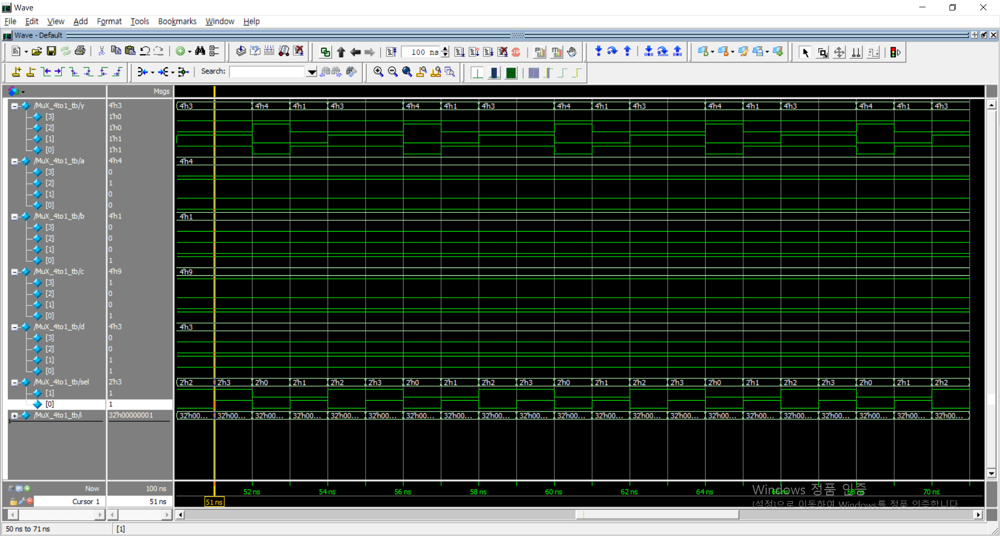

# 4 to 1 MUX

2016116783 Kim Seongrok

```verilog
module MuX_4to1(a,b,c,d,sel,y);
	// 4-bit input
	input [3:0] a, b, c, d;
	// 2 * 2-bit input
	input [1:0] sel;
	// 4-bit output
	output reg [3:0] y;
	
	// divide each case of sel
	always @(*) begin
		if (sel == 00)
			y=a;
		else if (sel == 01)
			y=b;
		else if (sel == 10)
			y=c;
		else
			y=d;
		default
			y=0;
	end

endmodule
```

```verilog
module MuX_4to1_tb();
	// 4-bit input
	wire [3:0] y;
	reg [3:0] a,b,c,d;
	reg [1:0] sel;

	// Do not use integer in the module
	integer i;
	
	MuX_4to1 u1(a,b,c,d,sel,y);

	// initialize input data by random	
	initial begin
		a=$random; b=$random; c=$random; d=$random; sel=0;
	end
	
	// explore sel from 00 to 11
	always
		for(i=0; i<5; i=i+1)
			#1 sel = sel+1;
			
endmodule
```

