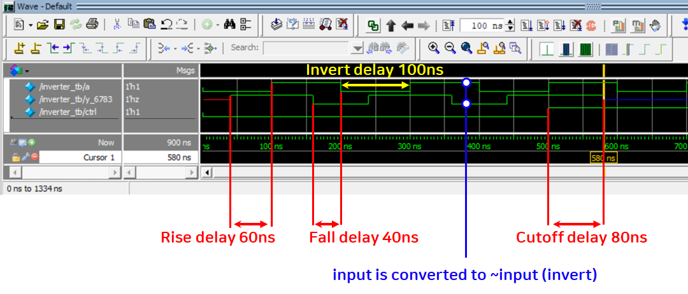

# INVERTER from notif0

Seongrok Kim - 2016116783

# SourceCode

```verilog
/* Use notif0 or notif1
Rise delay: 40ns
Fall delay: 60ns
Turn-off delay: 80ns
*/

// set timescale to 10ns on 1ns resolution
`timescale 10ns/1ns
module inverter_tb();

	// declare input, control, and output
	reg a;
	reg ctrl;
	wire y_6783;
	
	// make instace of notif0 that has 40ns of rise delay, 60ns of fall delay and 80ns of turnoff delay
	notif0 #(4,6,8) u0 (y_6783, a, ctrl);
	
	// initialize input as random and ctrl to 0
	initial begin
		a = $random; ctrl = 0;
	end
	
	// change condition of input every 100ns
	always #10 a = ~a;
	// change condition of ctrl so that I can check the state when the ctrl is 1
	always #50 ctrl = ~ctrl;
	
endmodule
```

# Result

