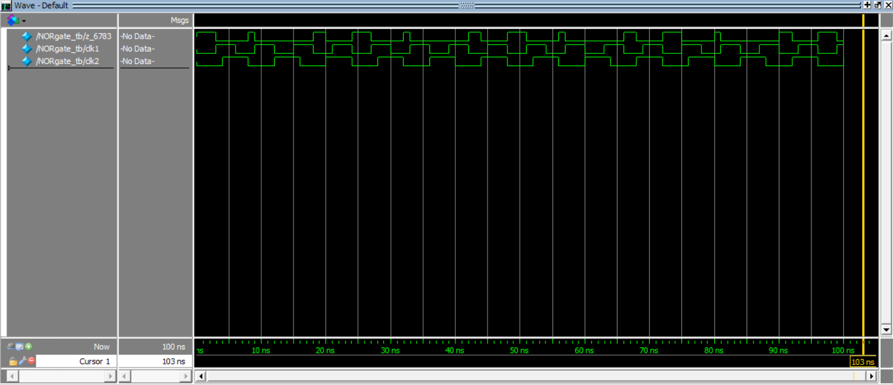

# NOR GATE

2016116783 KIM SEONGROK

# SourceCode

```verilog
// NOR GATE
module NORgate(A,B,Z);    
	
	// get input and output
	input A,B;
	output Z;
	
	// assign logical statement
	assign Z = ~(A||B);

endmodule
```

```verilog
// set timescale to 1ns
`timescale 1ns/1ns
module NORgate_tb();

	// set IOs
	wire z_6783;
	reg clk1,clk2;

	// call NORgate named innerpeace
	NORgate innerpeace(clk1,clk2,z_6783);
	
	// set __init__
	initial begin
		clk1=0;
		clk2=0;
	end
	
	// set always sequence of clk and delay
	always
		#3 clk1 = ~clk1;
	always
		#4 clk2 = ~clk2;

endmodule
```

# Output

