# Verilog

초기 컴퓨터 : 진공관 (But 전력소모, 크기 너무 Big)

IC(Intergrated circuits in) : SSI → MSI → LSI → VLSI 로 넘어가면서 트랜지스터가 너무 많아지니까 자동으로 뽑아줄 프로그램이 필요해짐 **(EDA; Electro Design Automation)**

## ENIAC : 최초의 컴퓨터

존나큼, 전기를 존나씀

## 인텔의 초기 CPU 디자인

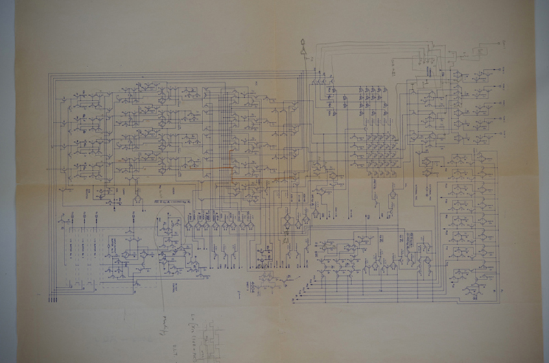

인텔의 미친짓 : 회로를 직접 하나하나 다그림 → 수정하기가 존내 힘들다

### HDL(Hardware Description Language) : 회로설계의 자동화

- Cadence Design Systems : 베릴로그 개발
- Synopsys Inc. : 컴파일러 개발

### RTL(Register Transfer Level) : HDL에 의한 하드웨어 간의 신호 흐름 설명

- Combinational Logic : 입력값에 따라 출력값이 바로 결정됨
- Register : 특정 값을 기억할 수 있음

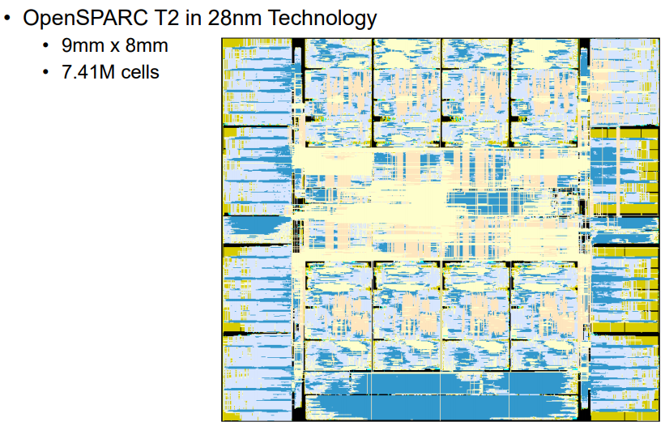

이제 초미세공정이라서 선밖에 안3보임  → 코딩으로 해치워야함

### Schematic(비주얼 언어)

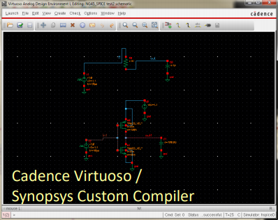

### 베릴로그(간-단)

```verilog
module inv(input A, output B);

	//-- Both the input and the output are "wires"
	wire A;
	wire B;

	//-- Assign the inverse of the input, to the output
	assign B = ~A;

endmodule
```

# CHAPTER 2

## Design Methodologies

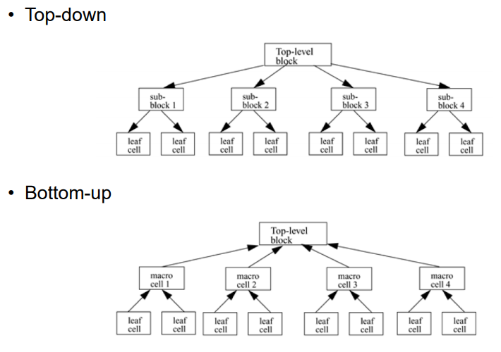

### 구현해보자

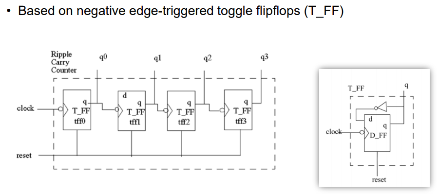

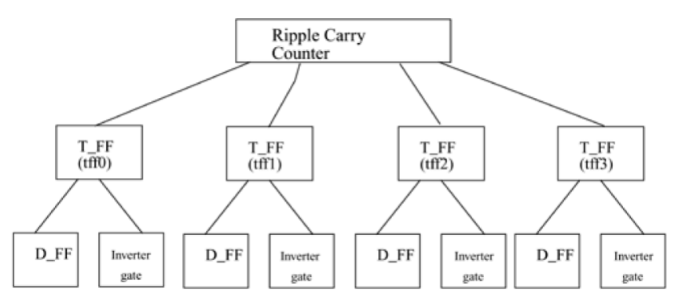

Ripple Carry counter 모듈에서 T_FF 인스턴스를 4개 생성

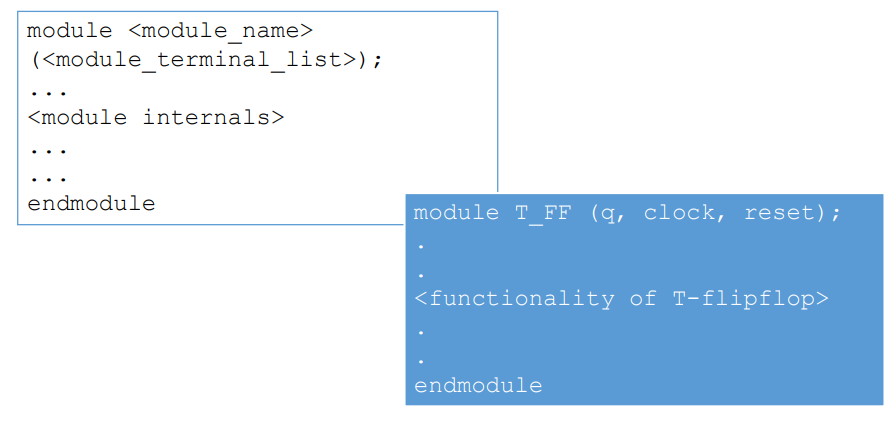

그거대로 코딩한거

module : 일반 코딩에서 클래스 개념이라고 보면 됨

```verilog
module T_FF (q, clock, reset);

...

endmodule
```

```python
class T_FF (Ripple_Carry_Counter) :	
	def __init__(self, q, clock, reset) :
		self.q = q
		self.clock = clock
		self.reset = reset
	
	...
```

# Chapter 3

### 게이트 구현해보자

디버깅

- 소프트웨어 : Printf로 확인
- 하드웨어 : input을 0과 1을 넣어서 확인

```verilog
// 인버터 구현
module inverter(a,z);    
	input a;
	output z;
	
	// 의미를 할당하는 부분
	assign z = ~a;

endmodule
```

```verilog
// 테스트
// timescale : 시간 단위 / 해상도 (보통 1ns/10ps)
`timescale 1ns/1ns
module inverter_tb();
	wire z;
	reg a;

	inverter u1 (a,z);
	
	// 초기화
	initial
		a=0;

	// 항상
	always
		// 1ns 마다 not a를 해라
		#1 a = ~a;

endmodule
```

**비트 연산자**

- ~ : NOT 연산자
- & : AND 연산자
- | : OR 연산자
- ^ : XOR 연산자
- ^~ , ~^ : XNOR 연산자

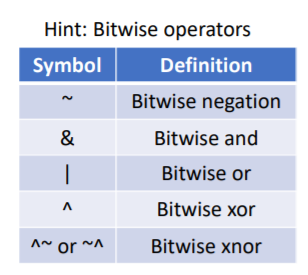

**게이트 구현**

- NOT GATE
- AND GATE
- OR GATE
- NAND GATE
- NOR GATE
- XOR GATE
- XNOR GATE

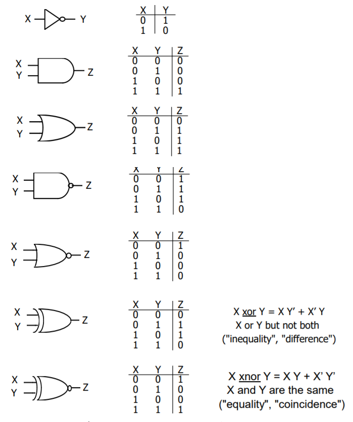

```verilog
// NOR GATE
module NORgate(A,B,Z);    
	
	// get input and output
	input A,B;
	output Z;
	
	// assign logical statement
	assign Z = ~(A||B);

endmodule
```

```verilog
// set timescale to 1ns
`timescale 1ns/1ns
module NORgate_tb();

	// set IOs
	wire z_6783;
	reg clk1,clk2;

	// call NORgate named innerpeace
	NORgate innerpeace(clk1,clk2,z_6783);
	
	// set __init__
	initial begin
		clk1=0;
		clk2=0;
	end
	
	// set always sequence of clk and delay
	always
		#3 clk1 = ~clk1;
	always
		#4 clk2 = ~clk2;

endmodule
```

[NOR GATE](NORGATE.md)

## 문법

- 공백 : 의미없음 (String 빼고)
- 주석 : `//` (한줄) ,  `/* */` (두줄)
- 연산자 : 한개, 두개, 여러개 사용 가능 (C처럼)
- Sized numbers
  - Binary number (4'b1111) // 4비트
  - Hexadecimal number (12'habc) // 12비트
  - Decimal number (16'd255) // 16비트
- Unsized numbers
  - Decimal number by default (23456) // 32비트
  - Hexadecimal number ('hc3) // 32비트
  - Octal number ('o21) // 32비트
- **X or Z values**
  - *X* : Unknown logic value
  - *Z (High Impedance)* : 존나 큰 저항 (== **Not connected**!!)
- 밑줄 : 아무 의미없음, 읽기 쉬우라고 사용 (12'b1111_0000_1010)
- 물음표 : z랑 같음, (4'b10?? == 4'b10zz)
- 문자열 : 엥간하면 한줄에 다쓰셈, 테스트나 디버깅에 사용
- 키워드(Keyword) : 소문자로 쓰셈
- 식별자(Identifier) : 알파벳, 숫자, 밑줄, $ 등 있는데 걍 소문자/숫자 쓰셈, $는 처음에 쓰지 마셈

[Verilog HDL 문법 (키워드, 식별자, 숫자)](https://rebas.kr/211)

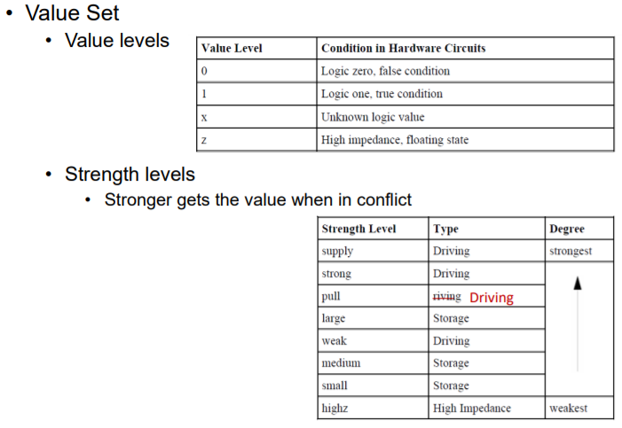

**강한 노드가 다른 노드를 잡아먹음**

- **Net** :  하드웨어 구성요소들 간의 커넥션
  - 키워드 : wire
  - 디폴트 : Z, 1비트
  - 같은 의미에 다른 데이터 타입들 ~~(파이썬의 리스트, 튜플 같은 느낌)~~ 이 많긴한데 wire만 쓰셈
  - **값을 못바꿈!!!**
- **Register** : 데이터를 저장하고 있는 구성요소
  - 키워드 : reg
  - 디폴트 : X
- **Vector** : 배열이랑 비슷, bit들의 집합
  - 디폴트 : 스칼라, 1비트
  - 슬라이싱 : 똑같이 하면됨
  - Ex> `wire [7:0] bus;`, `reg [0:40] virtual_addr;`

# Chapter 4

## 모듈 :

```verilog
// 1줄이면 그냥 쓰삼
always
	#1 a = ~a;
always
	#2 b = ~b;
// 따로따로 작동한다 // a 작동과 b 작동 동시 // a는 1초, b는 2초 딜레이
```

```verilog
// 2줄 이상이면 begin - end 구문 사용
always begin
	#1 a = ~a;
	#2 b = ~b;
end
// 같이 작동한다 // a 작동 후 b 작동 // a,b 둘다 3초 딜레이
```

## MUX(Multiflexer) : 스위칭(외부입력 선택기 같은 느낌)

[2 to 1 MUX를 만드는 7가지 방법](2to1MUX.md)

[4 to 1 MUX](4to1MUX.md)

### Primitive gates : Verilog에서 기본적으로 제공하는 내장함수

- not, buf, and, or, nand, nor, xor, xnor, ...

# Chapter 5

## Gate Type

- AND / OR Gates : multiple scalar inputs, one scalar output

  - 인스턴스 이름 : 디버깅을 위해 구분되도록 지으셈

- BUF / NOT Gates : one scalar input, one+ scalar outputs

  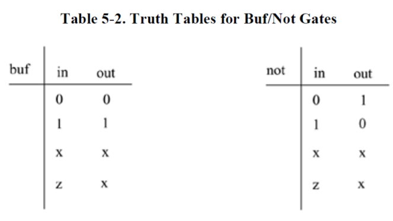

```verilog
// Primitive gate, 문법에 주의하자(output이 앞에있음)
buf b1(OUT1, IN);
not n1(OUT1, IN);

// More than two outputs
buf b1_2out(OUT1, OUT2, IN);

// gate instantiation without instance name
// 이렇게해도 상관은 없지만 디버깅을 위해서 이름을 넣어줍시다
not (OUT1,  IN); // legal gate instantiation
```

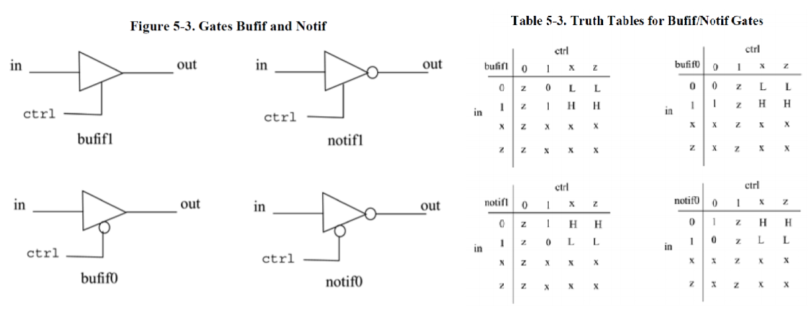

# Chapter 6

[INVERTER from notif0](INVERTER.md)

[Verilog](csv.csv)