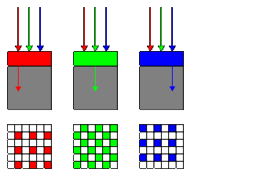

# Raw Bayer Pattern(베이어 패턴)

[이미지 센서와 Raw Bayer Pattern (베이어 패턴)](https://darkpgmr.tistory.com/97)

카메라에서 촬영한 이미지를 케이블을 통해 전송하게 되면 제한된 bandwidth에 의해 전송속도가 줄어들게 됩니다. 예를 들어, 1024x1024인 이미지를 보낸다고 생각해봅시다. 이를 그냥 보내면 한장당 3MB의 데이터를 전송해야 하지만 Raw Bayer Pattern 데이터를 보내면 색상의 손실없이 1MB의 데이터만 전송하면 됩니다.

우리는 흔히 500백만 화소=500백만개의 색을 감지할 수 있는 센서라고 생각합니다. 그런데 화소수가 500백만개인 것은 맞지만 각 화소는 실제 색(color)를 감지하는 화소가 아닌 단지 흑백의 밝기만 감지하는 monochorme 화소이며, RGB필터중 하나와 결합된 형태입니다.

즉, **이미지 센서는 화소수만큼 배열된 mono 셀들 위에 RGB 색상 필터들이 특정한 패턴을 가지고 배치된 것입니다.**

그런데 다들 잘 아시겠지만, 색 필터를 통과하게 되면 그 색을 제외한 나머지 색은 흡수됩니다. 따라서 하나의 센서(셀)은 한가지 색만 감지할 수 있게되는거죠.

따라서 전통적인 CMOS, CCD 이미지 센서에서는 특정한 패턴을 가지고 RGB 필터들을 배치하는데, **인간의 시각 특성을 따라서 Red 25%, Green 50%, Blue 25%가 되도록 교차적으로 배치한 패턴**이 바로 **베이어 패턴**입니다

베이어 필터 패턴

하지만 저희가 영상을 볼때는 각 화소마다 RGB 전체 색상을 보여주죠? 각 화소마다 비어있는 색상 값을 소프트웨어적 보간(interpolation)을 적용하여 채워줘서 모든 화소에 색을 구성하게 됩니다. 

## 1. Pixel Doubling Interpolation

: 주변 색상값들을 그냥 가져옵니다.

## 2. Bilinear Interpolation

: 주변 감싸는 애들을 갯수로 나눕니다.

