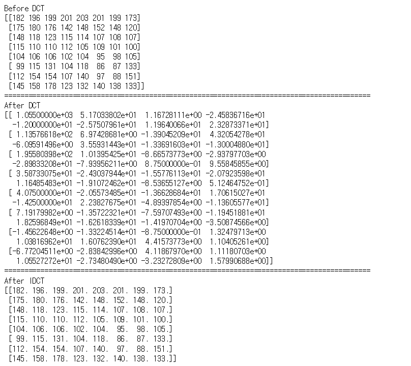
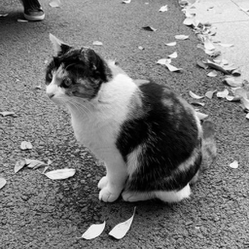

# Homework#5 DCT Lossy Compression

# Sample

## 8x8

```python
import cv2
import numpy as np
from math import cos,pi,radians,degrees

B = np.zeros((8,8,8,8))
temp = np.zeros((8,8,8,8))
F = np.zeros((8,8))
f_bar = np.zeros((8,8))

def C(delta) : #Cosine Transform
    if delta == 0 : return 1/(2**.5)
    else : return 1.0
    
sample = np.array([
[182,196,199,201,203,201,199,173],
[175,180,176,142,148,152,148,120],
[148,118,123,115,114,107,108,107],
[115,110,110,112,105,109,101,100],
[104,106,106,102,104,95,98,105],
[99,115,131,104,118,86,87,133],
[112,154,154,107,140,97,88,151],
[145,158,178,123,132,140,138,133],
])

print("Before DCT")
print(sample)
print('===========================================================================================')

# Set 8x8 DCT basis
for u in range(8) : 
    for v in range(8) : 
        for i in range(8) : 
            for j in range(8) : 
                B[u][v][i][j]= ( C(u)*C(v)/4.0 ) * cos((2*i+1)*float(u)*pi/16.0 ) * cos((2*j+1)*float(v)*pi/16.0 )

# Discrete Cosine Transformation        
for u in range(8) : 
    for v in range(8) : 
        F[u][v] = np.sum(np.multiply(sample,B[u][v]))

print("After DCT")        
print(F)
print('===========================================================================================')

# Discrete Cosine Transformation        
for i in range(8) : 
    for j in range(8) : 
        for u in range(8) : 
            for v in range(8) : 
                temp[i][j][u][v] = ( C(u)*C(v)/4.0 ) * cos((2*i+1)*float(u)*pi/16.0 ) * cos((2*j+1)*float(v)*pi/16.0 ) * F[u][v]
                
        f_bar[i][j] = np.sum(temp[i][j])

print("After IDCT")        
print(f_bar)
```



## 4x4

```python
import cv2
import numpy as np
from math import cos,pi,radians,degrees

B = np.zeros((8,8,8,8))
temp = np.zeros((8,8,8,8))
F = np.zeros((8,8))
f_bar = np.zeros((8,8))

def C(delta) : #Cosine Transform
    if delta == 0 : return 1/(2**.5)
    else : return 1.0
    
sample = np.array([
[182,196,199,201,203,201,199,173],
[175,180,176,142,148,152,148,120],
[148,118,123,115,114,107,108,107],
[115,110,110,112,105,109,101,100],
[104,106,106,102,104,95,98,105],
[99,115,131,104,118,86,87,133],
[112,154,154,107,140,97,88,151],
[145,158,178,123,132,140,138,133],
])

print("Before DCT")
print(sample)
print('===========================================================================================')

# Set 8x8 DCT basis
for u in range(8) : 
    for v in range(8) : 
        for i in range(8) : 
            for j in range(8) : 
                B[u][v][i][j]= ( C(u)*C(v)/4.0 ) * cos((2*i+1)*float(u)*pi/16.0 ) * cos((2*j+1)*float(v)*pi/16.0 )

# Discrete Cosine Transformation        
for u in range(4) : 
    for v in range(4) : 
        F[u][v] = np.sum(np.multiply(sample,B[u][v]))

print("After DCT")        
print(F)
print('===========================================================================================')

# Discrete Cosine Transformation        
for i in range(8) : 
    for j in range(8) : 
        for u in range(8) : 
            for v in range(8) : 
                temp[i][j][u][v] = ( C(u)*C(v)/4.0 ) * cos((2*i+1)*float(u)*pi/16.0 ) * cos((2*j+1)*float(v)*pi/16.0 ) * F[u][v]
                
        f_bar[i][j] = np.sum(temp[i][j])

print("After IDCT")        
print(f_bar)
```


## 2x2

```python
import cv2
import numpy as np
from math import cos,pi,radians,degrees

B = np.zeros((8,8,8,8))
temp = np.zeros((8,8,8,8))
F = np.zeros((8,8))
f_bar = np.zeros((8,8))

def C(delta) : #Cosine Transform
    if delta == 0 : return 1/(2**.5)
    else : return 1.0
    
sample = np.array([
[182,196,199,201,203,201,199,173],
[175,180,176,142,148,152,148,120],
[148,118,123,115,114,107,108,107],
[115,110,110,112,105,109,101,100],
[104,106,106,102,104,95,98,105],
[99,115,131,104,118,86,87,133],
[112,154,154,107,140,97,88,151],
[145,158,178,123,132,140,138,133],
])

print("Before DCT")
print(sample)
print('===========================================================================================')

# Set 8x8 DCT basis
for u in range(8) : 
    for v in range(8) : 
        for i in range(8) : 
            for j in range(8) : 
                B[u][v][i][j]= ( C(u)*C(v)/4.0 ) * cos((2*i+1)*float(u)*pi/16.0 ) * cos((2*j+1)*float(v)*pi/16.0 )

# Discrete Cosine Transformation        
for u in range(2) : 
    for v in range(2) : 
        F[u][v] = np.sum(np.multiply(sample,B[u][v]))

print("After DCT")        
print(F)
print('===========================================================================================')

# Discrete Cosine Transformation        
for i in range(8) : 
    for j in range(8) : 
        for u in range(8) : 
            for v in range(8) : 
                temp[i][j][u][v] = ( C(u)*C(v)/4.0 ) * cos((2*i+1)*float(u)*pi/16.0 ) * cos((2*j+1)*float(v)*pi/16.0 ) * F[u][v]
                
        f_bar[i][j] = np.sum(temp[i][j])

print("After IDCT")        
print(f_bar)
```


# 실습해보자

## 8x8

```python
import cv2
import numpy as np
from tqdm.notebook import tqdm
from math import cos,pi,radians,degrees

batch = np.zeros((8,8))
B = np.zeros((8,8,8,8))
temp = np.zeros((8,8,8,8))
F = np.zeros((8,8))
f_bar = np.zeros((8,8))
output = np.zeros((512,512))

lena = cv2.imread('lena.jpg',cv2.IMREAD_GRAYSCALE)

def C(delta) : #Cosine Transform
    if delta == 0 : return 1/(2**.5)
    else : return 1.0

for m in tqdm(range(64)) : 
    for n in range(64) : 
        batch = lena[m*8:(m+1)*8,n*8:(n+1)*8]

        # Set 8x8 DCT basis
        for u in range(8) : 
            for v in range(8) : 
                for i in range(8) : 
                    for j in range(8) : 
                        B[u][v][i][j]= ( C(u)*C(v)/4.0 ) * cos((2*i+1)*float(u)*pi/16.0 ) * cos((2*j+1)*float(v)*pi/16.0 )

        # Discrete Cosine Transformation        
        for u in range(8) : 
            for v in range(8) : 
                F[u][v] = np.sum(np.multiply(batch,B[u][v]))

        # Discrete Cosine Transformation        
        for i in range(8) : 
            for j in range(8) : 
                for u in range(8) : 
                    for v in range(8) : 
                        temp[i][j][u][v] = ( C(u)*C(v)/4.0 ) * cos((2*i+1)*float(u)*pi/16.0 ) * cos((2*j+1)*float(v)*pi/16.0 ) * F[u][v]

                f_bar[i][j] = np.sum(temp[i][j])

        output[m*8:(m+1)*8,n*8:(n+1)*8]=f_bar

cv2.imwrite('result8x8.png',output)
```

## 4x4

```python
import cv2
import numpy as np
from tqdm.notebook import tqdm
from math import cos,pi,radians,degrees

batch = np.zeros((8,8))
B = np.zeros((8,8,8,8))
temp = np.zeros((8,8,8,8))
F = np.zeros((8,8))
f_bar = np.zeros((8,8))
output = np.zeros((512,512))

lena = cv2.imread('lena.jpg',cv2.IMREAD_GRAYSCALE)

def C(delta) : #Cosine Transform
    if delta == 0 : return 1/(2**.5)
    else : return 1.0

for m in tqdm(range(64)) : 
    for n in range(64) : 
        batch = lena[m*8:(m+1)*8,n*8:(n+1)*8]

        # Set 8x8 DCT basis
        for u in range(8) : 
            for v in range(8) : 
                for i in range(8) : 
                    for j in range(8) : 
                        B[u][v][i][j]= ( C(u)*C(v)/4.0 ) * cos((2*i+1)*float(u)*pi/16.0 ) * cos((2*j+1)*float(v)*pi/16.0 )

        # Discrete Cosine Transformation        
        for u in range(4) : 
            for v in range(4) : 
                F[u][v] = np.sum(np.multiply(batch,B[u][v]))

        # Discrete Cosine Transformation        
        for i in range(8) : 
            for j in range(8) : 
                for u in range(8) : 
                    for v in range(8) : 
                        temp[i][j][u][v] = ( C(u)*C(v)/4.0 ) * cos((2*i+1)*float(u)*pi/16.0 ) * cos((2*j+1)*float(v)*pi/16.0 ) * F[u][v]

                f_bar[i][j] = np.sum(temp[i][j])

        output[m*8:(m+1)*8,n*8:(n+1)*8]=f_bar

cv2.imwrite('result4x4.png',output)
```

## 2x2

```python
import cv2
import numpy as np
from tqdm.notebook import tqdm
from math import cos,pi,radians,degrees

batch = np.zeros((8,8))
B = np.zeros((8,8,8,8))
temp = np.zeros((8,8,8,8))
F = np.zeros((8,8))
f_bar = np.zeros((8,8))
output = np.zeros((512,512))

lena = cv2.imread('lena.jpg',cv2.IMREAD_GRAYSCALE)

def C(delta) : #Cosine Transform
    if delta == 0 : return 1/(2**.5)
    else : return 1.0

for m in tqdm(range(64)) : 
    for n in range(64) : 
        batch = lena[m*8:(m+1)*8,n*8:(n+1)*8]

        # Set 8x8 DCT basis
        for u in range(8) : 
            for v in range(8) : 
                for i in range(8) : 
                    for j in range(8) : 
                        B[u][v][i][j]= ( C(u)*C(v)/4.0 ) * cos((2*i+1)*float(u)*pi/16.0 ) * cos((2*j+1)*float(v)*pi/16.0 )

        # Discrete Cosine Transformation        
        for u in range(2) : 
            for v in range(2) : 
                F[u][v] = np.sum(np.multiply(batch,B[u][v]))

        # Discrete Cosine Transformation        
        for i in range(8) : 
            for j in range(8) : 
                for u in range(8) : 
                    for v in range(8) : 
                        temp[i][j][u][v] = ( C(u)*C(v)/4.0 ) * cos((2*i+1)*float(u)*pi/16.0 ) * cos((2*j+1)*float(v)*pi/16.0 ) * F[u][v]

                f_bar[i][j] = np.sum(temp[i][j])

        output[m*8:(m+1)*8,n*8:(n+1)*8]=f_bar

cv2.imwrite('result2x2.png',output)
```


Original


8x8 Discrete Cosine Transform


4x4 Discrete Cosine Transform


2x2 Discrete Cosine Transform


Original


8x8 Discrete Cosine Transform



4x4 Discrete Cosine Transform


2x2 Discrete Cosine Transform

```markdown
**v=0일때**

**u=0**
0.125 0.125 0.125 0.125 0.125 0.125 0.125 0.125 
0.125 0.125 0.125 0.125 0.125 0.125 0.125 0.125 
0.125 0.125 0.125 0.125 0.125 0.125 0.125 0.125 
0.125 0.125 0.125 0.125 0.125 0.125 0.125 0.125 
0.125 0.125 0.125 0.125 0.125 0.125 0.125 0.125 
0.125 0.125 0.125 0.125 0.125 0.125 0.125 0.125 
0.125 0.125 0.125 0.125 0.125 0.125 0.125 0.125 
0.125 0.125 0.125 0.125 0.125 0.125 0.125 0.125 

**u=1**
0.173 0.147 0.098 0.034 -0.034 -0.098 -0.147 -0.173 
0.173 0.147 0.098 0.034 -0.034 -0.098 -0.147 -0.173 
0.173 0.147 0.098 0.034 -0.034 -0.098 -0.147 -0.173 
0.173 0.147 0.098 0.034 -0.034 -0.098 -0.147 -0.173 
0.173 0.147 0.098 0.034 -0.034 -0.098 -0.147 -0.173 
0.173 0.147 0.098 0.034 -0.034 -0.098 -0.147 -0.173 
0.173 0.147 0.098 0.034 -0.034 -0.098 -0.147 -0.173 
0.173 0.147 0.098 0.034 -0.034 -0.098 -0.147 -0.173 

**u=2**
0.163 0.068 -0.068 -0.163 -0.163 -0.068 0.068 0.163 
0.163 0.068 -0.068 -0.163 -0.163 -0.068 0.068 0.163 
0.163 0.068 -0.068 -0.163 -0.163 -0.068 0.068 0.163 
0.163 0.068 -0.068 -0.163 -0.163 -0.068 0.068 0.163 
0.163 0.068 -0.068 -0.163 -0.163 -0.068 0.068 0.163 
0.163 0.068 -0.068 -0.163 -0.163 -0.068 0.068 0.163 
0.163 0.068 -0.068 -0.163 -0.163 -0.068 0.068 0.163 
0.163 0.068 -0.068 -0.163 -0.163 -0.068 0.068 0.163 

**u=3**
0.147 -0.034 -0.173 -0.098 0.098 0.173 0.034 -0.147 
0.147 -0.034 -0.173 -0.098 0.098 0.173 0.034 -0.147 
0.147 -0.034 -0.173 -0.098 0.098 0.173 0.034 -0.147 
0.147 -0.034 -0.173 -0.098 0.098 0.173 0.034 -0.147 
0.147 -0.034 -0.173 -0.098 0.098 0.173 0.034 -0.147 
0.147 -0.034 -0.173 -0.098 0.098 0.173 0.034 -0.147 
0.147 -0.034 -0.173 -0.098 0.098 0.173 0.034 -0.147 
0.147 -0.034 -0.173 -0.098 0.098 0.173 0.034 -0.147 

**u=4**
0.125 -0.125 -0.125 0.125 0.125 -0.125 -0.125 0.125 
0.125 -0.125 -0.125 0.125 0.125 -0.125 -0.125 0.125 
0.125 -0.125 -0.125 0.125 0.125 -0.125 -0.125 0.125 
0.125 -0.125 -0.125 0.125 0.125 -0.125 -0.125 0.125 
0.125 -0.125 -0.125 0.125 0.125 -0.125 -0.125 0.125 
0.125 -0.125 -0.125 0.125 0.125 -0.125 -0.125 0.125 
0.125 -0.125 -0.125 0.125 0.125 -0.125 -0.125 0.125 
0.125 -0.125 -0.125 0.125 0.125 -0.125 -0.125 0.125 

**u=5**
0.098 -0.173 0.034 0.147 -0.147 -0.034 0.173 -0.098 
0.098 -0.173 0.034 0.147 -0.147 -0.034 0.173 -0.098 
0.098 -0.173 0.034 0.147 -0.147 -0.034 0.173 -0.098 
0.098 -0.173 0.034 0.147 -0.147 -0.034 0.173 -0.098 
0.098 -0.173 0.034 0.147 -0.147 -0.034 0.173 -0.098 
0.098 -0.173 0.034 0.147 -0.147 -0.034 0.173 -0.098 
0.098 -0.173 0.034 0.147 -0.147 -0.034 0.173 -0.098 
0.098 -0.173 0.034 0.147 -0.147 -0.034 0.173 -0.098 

**u=6**
0.068 -0.163 0.163 -0.068 -0.068 0.163 -0.163 0.068 
0.068 -0.163 0.163 -0.068 -0.068 0.163 -0.163 0.068 
0.068 -0.163 0.163 -0.068 -0.068 0.163 -0.163 0.068 
0.068 -0.163 0.163 -0.068 -0.068 0.163 -0.163 0.068 
0.068 -0.163 0.163 -0.068 -0.068 0.163 -0.163 0.068 
0.068 -0.163 0.163 -0.068 -0.068 0.163 -0.163 0.068 
0.068 -0.163 0.163 -0.068 -0.068 0.163 -0.163 0.068 
0.068 -0.163 0.163 -0.068 -0.068 0.163 -0.163 0.068 

**u=7**
0.034 -0.098 0.147 -0.173 0.173 -0.147 0.098 -0.034 
0.034 -0.098 0.147 -0.173 0.173 -0.147 0.098 -0.034 
0.034 -0.098 0.147 -0.173 0.173 -0.147 0.098 -0.034 
0.034 -0.098 0.147 -0.173 0.173 -0.147 0.098 -0.034 
0.034 -0.098 0.147 -0.173 0.173 -0.147 0.098 -0.034 
0.034 -0.098 0.147 -0.173 0.173 -0.147 0.098 -0.034 
0.034 -0.098 0.147 -0.173 0.173 -0.147 0.098 -0.034 
0.034 -0.098 0.147 -0.173 0.173 -0.147 0.098 -0.034
```