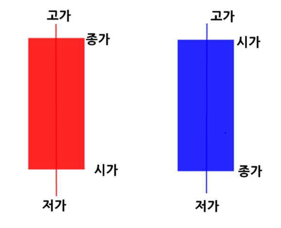

# 배경

주식투자 : 어떠한 환경에서 매수(buy), 매도(sell), 관망(hold) 등을 판단하는 문제

투자자 → 매수,매도,관망 (행동) → 차트 데이터 → 손익 (보상) → 학습

차트데이터 : 어떠한 종목의 시가, 고가, 저가, 종가, 거래량 등의 데이터

봉차트(캔들차트) : 몸통과 꼬리로 이루어진 차트, 양봉과 음봉으로 구분

고가 : 봉의 기간동안 가장 높게 거래된 가격

종가 : 봉의 기간동안 가장 마지막에 거래된 가격

시가 : 봉의 기간동안 가장 처음에 거래된 가격

저가 : 봉의 기간동안 가장 낮게 거래된 가격

일봉차트 예시 // 양봉일때 고가와 종가가 거의 같다는건 눈치가 개빠르단 뜻이겠죠?

# 강화학습으로 주식을 학습하는 방식

## 가정

- 초기자본 : 1000만원
- 거래수수료, 세금 고려 x
- 1주씩만 매수, 매도
- 2% 손익발생시에만 보상

20% 이익이 난 지점 → 이때까지 잘했다는 뜻이므로 그 전까지의 지점에 양의 보상을 줌

20% 손해가 난 지점 → 이때까지 못했다는 뜻이므로 그 전까지의 지점에 음의 보상을 줌

이대로 진행한다면 인공지능이 최종적으로 평가했을 때 1~3지점은 잘했다고 칭찬을, 4~5지점은 개못했다고 욕을 박을겁니다. 이제 저희가 할 것은 여기에 누적 보상에 따라 매수량과 매도량을 적절히 조절하는 과정입니다.

## 거래 수수료, 거래세

- 매수 수수료 : 0.015%
- 매도 수수료 : 0.015%
- 거래세 : 0.3%

**거래를 적게 할 수록 비용이 적게 든다!**

## 무작위 행동 비율

ε(엡실론) : 무작위로 결정하는 비율, 학습의 대상이 될 파라미터입니다.

# 학습 방식 구성

## 학습 데이터

- 전일 종가 당일 시가 비율
- 당일 종가 대비 당일 고가 비율
- 당일 종가 대비 당일 저가 비율
- 당일 종가 대비 전일 종가 비율
- 전일 거래량 대비 당일 거래량 비율

- 5일 평균 종가 대비 당일 종가 비율
- 10일 평균 종가 대비 당일 종가 비율
- 20일 평균 종가 대비 당일 종가 비율
- 60일 평균 종가 대비 당일 종가 비율
- 120일 평균 종가 대비 당일 종가 비율

- 5일 평균 거래량 대비 당일 거래량 비율
- 10일 평균 거래량 대비 당일 거래량 비율
- 20일 평균 거래량 대비 당일 거래량 비율
- 60일 평균 거래량 대비 당일 거래량 비율
- 120일 평균 거래량 대비 당일 거래량 비율

- 주식 보유 비율 = 현재 보유 주식 수 / 최대 보유 가능 주식 수
- 포트폴리오 가치 비율 = 현재 포트폴리오 가치 / 기준 포트폴리오 가치

## 보상 규칙

손익률의 %(퍼센트)로 보상

예) 이익률 5% 이상, 손신률 3%이하면 보상을 부여합니다.

## 행동 종류

기본 : 매수, 매도, 관망

심화 : 공격적 매수, 방어적 매수, 공격적 매도, 방어적 매도, 관망

→ 최소, 최대 투자단위를 결정해놓고 진행

## 신경망

DNN : 수많은 경우의 수를 학습할 때 적합함 (알파고)

RNN : 주식차트와 같이 이때까지의 행동을 고려하여 다음 행동을 결정할 때 적합함 ( 날씨 예측 )

CNN : 5일, 10일등 여러 기간의 특징을 한번에 고려하여 학습할 때 적합함 ( 이미지 인식 )

Ensemble (앙상블) : 위의 방법등을 모두 사용하는 방법

## 강화학습

Q 러닝 (regression) : 특정 행동을 취했을 때 예측되는 포트폴리오 가치를 회귀할 때 사용

정책 경사 (policy gradient) : 현재 상태에서 어떤 행동이 가장 좋을 지 확률적으로 판단

## 용어들

파라미터(parameter) : 학습속도(learning rate), 할인요인(discount factor), 최소/최대 투자 단위(trading unit) 등의 학습시킬 미지수들

에포크(epoch) : 학습을 진행할 횟수, 보통 에포크가 많을 수록 더 정확해지지만 시간이 오래 걸림