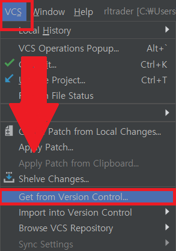

# 준비

# Requirement (필요 환경)

- 운영체제(OS) : Window 10 x64bit
- 통합개발환경(IDE) : Pycharm
- 개발 언어 : Python3
- 필요 프로그램 : Anaconda3
- 라이브러리 : Numpy, Pandas, Matplotlib, Tensorflow, Keras, matplotlib.finance

**텐서플로우 설치 시 파이썬 버전은 3.6으로 바꾸고 해주세요. 버전이 너무 높으면 다른 모듈과 호환성이 좋지 않습니다. ( pip install python=3.6 )**

**matplotlib.finance 모듈은 원래 matplotlib 하위 모듈이었다가 분리되었습니다.  깃허브 레포에서 직접 인스톨해주세요. (pip install https://github.com/matplotlib/mpl_finance/archive/master.zip)**

1. 파이참을 실행해주세요

2. 상단 툴바에서 VCS → Get from Version control을 누릅니다

3. URL에 [https://github.com/quantylab/rltrader.git](https://github.com/quantylab/rltrader.git) 을 붙여넣기하고 clone을 누르면 레포지토리가 그대로 파이참으로 옮겨옵니다.

4. 다시 상단툴바에서 File→Settings→Project→Project Interpreter를 선택후 미리 만들어놓은 가상환경에 접속합니다.

5. 모든 과정이 끝났으면 이와 같은 화면이 나올겁니다.