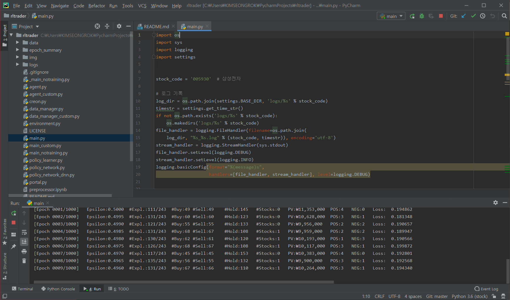

# 시작

일단 무식하게 돌려봅시다

[main.py](http://main.py) 파일을 열고 run을 해보면 이렇게 epoch가 진행되면서 모델을 깎고 있는 모습을 확인할 수 있습니다.

왼쪽 폴더에서 epoch_summary 폴더에 들어가면 이렇게 가시화한 내용도 확인할 수 있습니다.

에포크가 진행되면서 최적의 값을 찾아가는 모습입니다. 이 모델은 초반에 손해보더라도 후반에 이득보는 방법을 취했네요. 어차피 우리는 최종 값만 볼겁니다.

# 주식 데이터 획득

증권사 홈페이지로 부터 주식 데이터를 가져와봅시다.

- 증권사 HTS 사용 : 증권사에서 수동으로 데이터를 가져와 적용하는 방법
- 증권사 API 사용 : 증권사에서 제공하는 툴을 이용해 데이터를 가져와 적용하는 방법
- 포털 사이트 사용 : 포털 사이트에 제공된 정보를 가져와 적용하는 방법

## 증권사 API 설치

### [키움증권 API 제공 홈페이지](https://www1.kiwoom.com/nkw.templateFrameSet.do?m=m1408010000)

로그인 후 사용신청부터 차례대로 해줍시다

모듈 다운로드까지 완료했으면 KOA studio도 다운로드해주시고

[Anaconda Python/R Distribution - Free Download](https://www.anaconda.com/distribution/#download-section)

아나콘다 홈페이지에서 **32bit** 버전을 받아주세요. 키움증권의 API가 32비트로 작성되어있어서 64bit 파이썬은 인식을 못한다고하네요( 책은 대신증권이긴한데 키움증권도 32bit 사용합니다 )

[자료실](https://www1.kiwoom.com/nkw.templateFrameSet.do?m=m1408010000)

다시 여기에 들어가셔서 자료실에 들어가면 소스코드가 있습니다. 가장 최신 파일을 받아줄께요.

khOpenApiTest.sln 파일을 관리자권한으로 열고

솔루션 우클릭 → 솔루션 대상 변경 → 비주얼 스튜디오 버전을 맞춰줍니다.

그다음에 로컬 디버거 버튼을 눌러 컴파일 해주면 로그인 창이 뜬 뒤에

다음과 같은 창을 볼 수 있습니다.

다음시간에는 이 c++ 모듈들을 Python으로 옮겨보는 작업을 해보겠습니다.