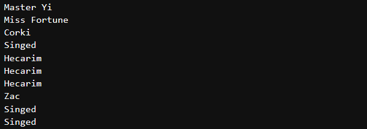

# find(find_all) 메소드

find 와 find_all의 기본문법은 다음과 같습니다.

`find_all(tag, attributes, recursive, text, limit, keywords)`

`find(tag, attributes, recursive, text, keywords)`

**tag** `.find_all("h1","h2", "span")` 식으로 리스트를 넘길 수 있습니다.

**attributes** `.find_all("div",{"class" : "ChampionName"})` 해당 태그의 속성을 정의합니다.

**recursive** 찾은 태그의 자식까지 탐색합니다(True,디폴트) or 최상위 태그만 탐색합니다(False)

**text** `.find_all(text="레넥톤")` 일치하는 텍스트를 검색합니다.

**limit** `.find_all("Champion",limit=3)` 처음 몇개만 가져올 때 사용합니다.

**keyword** `.find_all(id="text")` 특정 속성이 포함된 태그를 선택합니다.

(attributes와 keyword가 비슷하긴한데 class="ChampionName"과 같은건 잘 안먹으니 "div",{"class"="ChampionName"}과 같이 사용하자)


아이유를 검색한 창에서 컨트롤+쉬프트+c 를 누른상태에서 챔피언 이름부분을 클릭해보자. 그러면 오른쪽에 개발자 창이 뜨면서 선택한 부분의 HTML 구문이 선택될 것이다. 


Select할때와 같이 공통분모를 찾아준다.

select때와 다르게, 뽑아내고자 하는 클래스에 구별되는 속성이 없을때는 이렇게 여러 단계를 거쳐준다.

```python
List = soup.find("div",{"class":"GameItemList"})
Contents = List.find_all("div",{"class":"ChampionName"})

for Content in Contents :
	print(Content.find("a").text)
```



변수를 넣기 싫으면 한번에 해도된다. 대신 find_all은 리스트 형태로 출력되므로 반복문을 통해 풀어줘야한다.

```python
Contents = soup.find("div",{"class":"GameItemList"}).find_all("div",{"class":"ChampionName"})
for Content in Contents :
	print(Content.find("a").text)
```

select와 마찬가지로 공통분모를 무시하면 안된다.

```python
Contents = soup.find_all("div",{"class":"ChampionName"})

for Content in Contents :
	print(Content.find("a").text)
```


```python
from urllib.request import urlopen
from bs4 import BeautifulSoup as bs

page = urlopen("https://www.op.gg/summoner/userName=%EC%95%84%EC%9D%B4%EC%9C%A0")
document = page.read()
page.close()

soup = bs(document, 'html.parser')

List = soup.find("div",{"class":"GameItemList"})

champ = List.find_all("div",{"class":"ChampionName"})

kill = List.find_all("span","Kill")
death = List.find_all("span","Death")
assist = List.find_all("span","Assist")

playTime = List.find_all("div",{"class" : "GameLength"})

for i in range(4) : 
    print('Champion : {}'.format(champ[i].find("a").text))
    print('KDA : {}/{}/{}'.format(kill[i].text,
                                  death[i].text,
                                  assist[i].text))
    print('Play Time : {}\n'.format(playTime[i].text))
```


근데 대충하면 이렇게 나온다 잉?


알고보니 요놈 이름도 Kill이더라 ㅡㅡ;;

```python
from urllib.request import urlopen
from bs4 import BeautifulSoup as bs

page = urlopen("https://www.op.gg/summoner/userName=%EC%95%84%EC%9D%B4%EC%9C%A0")
document = page.read()
page.close()

soup = bs(document, 'html.parser')

List = soup.find("div",{"class":"GameItemList"})

champ = List.find_all("div",{"class":"ChampionName"})

kill = List.find_all("span","Kill")
death = List.find_all("span","Death")
assist = List.find_all("span","Assist")

playTime = List.find_all("div",{"class" : "GameLength"})

for i in range(4) : 
    print('Champion : {}'.format(champ[i].find("a").text))
    print('KDA : {}/{}/{}'.format(kill[**2*i**].text,
                                  death[i].text,
                                  assist[i].text))
    print('Play Time : {}\n'.format(playTime[i].text))
```


귀찮아서 하드코딩 해버렸다. 홈페이지 만들때 클래스 이름 중복안되게 잘하자...

~~크롤링하는사람도 생각해주세요~~