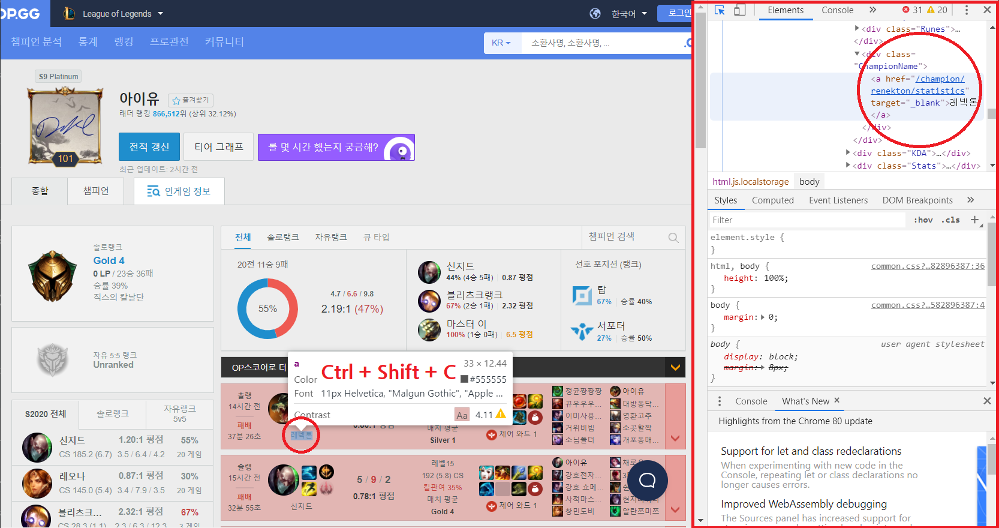

# select 메소드



아이유를 검색한 창에서 컨트롤+쉬프트+c 를 누른상태에서 챔피언 이름부분을 클릭해보자. 그러면 오른쪽에 개발자 창이 뜨면서 선택한 부분의 HTML 구문이 선택될 것이다. 


선택된 부분을 우클릭 후 Copy → Copy selector를 눌러 해당 부분의 경로를 가져온다.

`#SummonerLayoutContent > div.tabItem.Content.SummonerLayoutContent.summonerLayout-summary > div.RealContent > div > div.Content > div.GameItemList > **div:nth-child(4)** > div > div.Content > div.GameSettingInfo > div.ChampionName > a`

그러면 다음과 같은 경로가 나올텐데, 이대로 선택을 한다면 '레넥톤' 이라는 글자만 선택될 것이다. 하지만 우리는 최근 4개의 챔피언 목록을 가져올것이므로 최근 경기 목록들의 공통 분모를 찾아본다.

`#SummonerLayoutContent > div.tabItem.Content.SummonerLayoutContent.summonerLayout-summary > div.RealContent > div > div.Content > div.GameItemList > **div:nth-child(5)** > div > div.Content > div.GameSettingInfo > div.ChampionName > a`

바로 밑의 '신지드' 챔피언의 경로이다. 위의 경로와 비교해봤을때 다른점이 하나 보인다.


실제로 각각의 게임 플레이는 GameItemList 하위의 GameItemWrap 항목들로 구분되어 있는것을 알 수 있다. 우리는 이 녀석들의 공통점을 찾아서 선택해주면 되기 때문에, 저 부분(몇번째 자식)만 빼고 선택해주면 우리가 원하는 정보를 얻을 수 있을 것이다. 

```python
name = soup.select( """
    #SummonerLayoutContent >
    div.tabItem.Content.SummonerLayoutContent.summonerLayout-summary >
    div.RealContent > div > div.Content >
    div.GameItemList > **div** > div > div.Content >
    div.GameSettingInfo > div.ChampionName > a
    """
)

for n in name :
    print(n.text)
```


공통 분모만 찾아주면 되기때문에, 더 간단히 할 수도 있다.

```python
name = soup.select( "div.Content > div.GameSettingInfo > div.ChampionName > a" )
```

하지만  무작정 줄이면 안된다.

```python
name = soup.select( "div.ChampionName > a" )
```


위와 같이 하면 이상한 값이 나오게되는데,


옆에 있는 전체 전적의 챔피언 이름또한 ChampionName 클래스를 사용하고 있기 때문이다. 

**내가 원하는 데이터만 가져오기 위해서는 정확한 분류작업이 필요하다.**

```python
from urllib.request import urlopen
from bs4 import BeautifulSoup as bs

page = urlopen("https://www.op.gg/summoner/userName=%EC%95%84%EC%9D%B4%EC%9C%A0")
document = page.read()
page.close()

soup = bs(document, 'html.parser')

kills = soup.select(
    "div.Content > div.KDA > div.KDA > span.Kill"
)
death = soup.select(
    "div.Content > div.KDA > div.KDA > span.Death"
)
assist = soup.select(
    "div.Content > div.KDA > div.KDA > span.Assist"
)

champ = soup.select(
    'div.Content > div.GameSettingInfo > div.ChampionName > a'
)

playTime = soup.select(
    'div.Content > div.GameStats > div.GameLength'
)

for i in range(4) : 
    print('Champion : {}'.format(champ[i].text))
    print('KDA : {}/{}/{}'.format(kills[i].text,death[i].text,assist[i].text))
    print('Play Time : {}\n'.format(playTime[i].text))
```


## Select 메소드 정리

```python
soup.select('원하는 정보')  # select('원하는 정보') -->  단 하나만 있더라도, 복수 가능한 형태로 되어있음
soup.select('태그명')
soup.select('.클래스명')
soup.select('상위태그명 > 하위태그명 > 하위태그명')
soup.select('상위태그명.클래스명 > 하위태그명.클래스명')    # 바로 아래의(자식) 태그를 선택시에는 > 기호를 사용
soup.select('상위태그명.클래스명 하~위태그명')              # 아래의(자손) 태그를 선택시에는   띄어쓰기 사용
soup.select('상위태그명 > 바로아래태그명 하~위태그명')     
soup.select('.클래스명')
soup.select('#아이디명')                  # 태그는 여러개에 사용 가능하나 아이디는 한번만 사용 가능함! ==> 선택하기 좋음
soup.select('태그명.클래스명')
soup.select('#아이디명 > 태그명.클래스명')
soup.select('태그명[속성1=값1]')
```