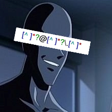

# Regular Expressions




## 정규식(23)

크롤링, 전처리의 절대권위자 정규식.

수많은 개발자들에게 고통을 선사한 규식씨를 만나봅시다.


> *??? : ㅋㅋㅋ 아 전처리 그럿개 하는거 아닌데;;*

# 목차

1. 정규표현식이란?

2. 정규표현식 예제

3. 정규표현식 문법

# 1. 정규표현식이란?

풀 네임은 정규 더 표현식(Regular Expression), 애칭으로 regex 혹은 regexp라고도 합니다.

프로그래밍에서 사용하는 일종의 형식언어인데, 일정한 규칙을 가진 텍스트 문자열(String)을 다룰 때 사용합니다. 잘 알아두면 문자열을 다룰 때 굉장히 유용하기 때문에 꼭 알아두는 걸 추천하지만, 상당히 난해하기 때문에 배우는게 매우 쉽지 않습니다. 본인도 이걸 굳이 해야되나 싶었지만 뭐 한번 해놓으면 두고두고 써먹을 것 같아서 이번기회에 한번 해보려고 합니다. 


화려한 경력을 자랑한다

# 2. 정규표현식 예제

정규식을 왜 써야할지 감이 안온다면, 다음의 예제를 보세요.

```
힙합이 너무 좋은 잼민이(11)는 '한국어로 시작해서 영어 6자리 이상으로 끝나는 가사'가 너무 좋아서 해당하는 다른 가사들을 찾고 있다. 이때 잼민이는 어떤 방법을 써서 크롤링을 진행해야 할까?
```

```
창모(CHANGMO) - METEOR

Yeah ha
Yeah ha
Yeah ha
Yeah ha
Yeah ha
Yeah ha
Yeah ha
Yeah ha
Yeah ha
Yeah ha
Yeah ha
Yeah ha
모두 그에게 말해 또 왔네
새꺄 whut
죽지 않고 왔다 이렇게
새꺄 뭐
Snacky chan의
라인을 빌릴래
했어 예수처럼 이렇게 부활을
031 팔 안쪽의
tatt freaky woah
어젠 시장님이 만나쟤 motown
어수룩해 엄마 속에 걱정
한 톤만큼 쌓고
스물한살에 독립했던 얘는
여섯이 되었고
발견했지 우연히 5년 전의 노트
정말 스타 되고 싶어
그럴려면 가서 만나면 돼 악마
노트를 덮고
거울에 비춰진 남자를 보니 와
저 손목이 너무 부러워
저 금 daydate rollie
넘을걸 천백은 더
```

보통 파이썬으로 이를 찾는다고 하면 다음과 같은 끔찍한 코드가 탄생합니다.

```python
for lyric in lyrics.split('\n') : 
	if ord('가') <= ord(lyric[0]) <= ord('힣')
   and any([ord('가') <= ord(l) <= ord('힣') for l in lyric[-6:]]) : 
		print(lyric)
```

사실 이것도 최대한 깔끔하게 쓴거긴 하네요.

하지만 정규식씨는 이딴거 없습니다.

```perl
^[ㄱ-ㅣ가-힣]+.+[a-zA-Z]{6,}$
```


진정하세요. 천천히 설명해드리겠습니다.

`^[ㄱ-ㅣ가-힣]+` : `하나 이상의 ㄱ부터 힣 사이의 문자(한글)로 시작해서` 

`.+` : `그다음에는 뭐가 몇개 오든 상관없고`

`[a-zA-Z]{6,}$` : `6개 이상의 a에서 z, A에서 Z(알파벳)으로 끝나는 문자열`

```
어젠 시장님이 만나쟤 motown
저 금 daydate rollie
```

정규표현식을 쓰면 이렇게 복잡한 구문도 ~~단순하고~~ 쉽게 추출할 수 있습니다.

그럼 조금 더 구체적으로 알아볼께요.

# 3. 정규표현식 문법